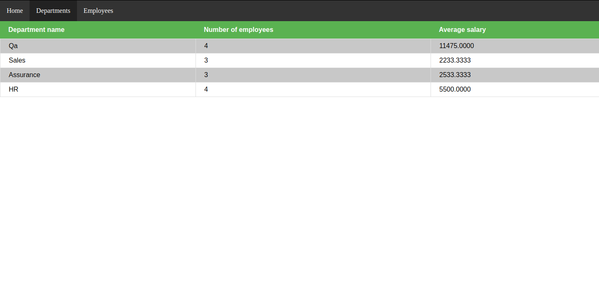
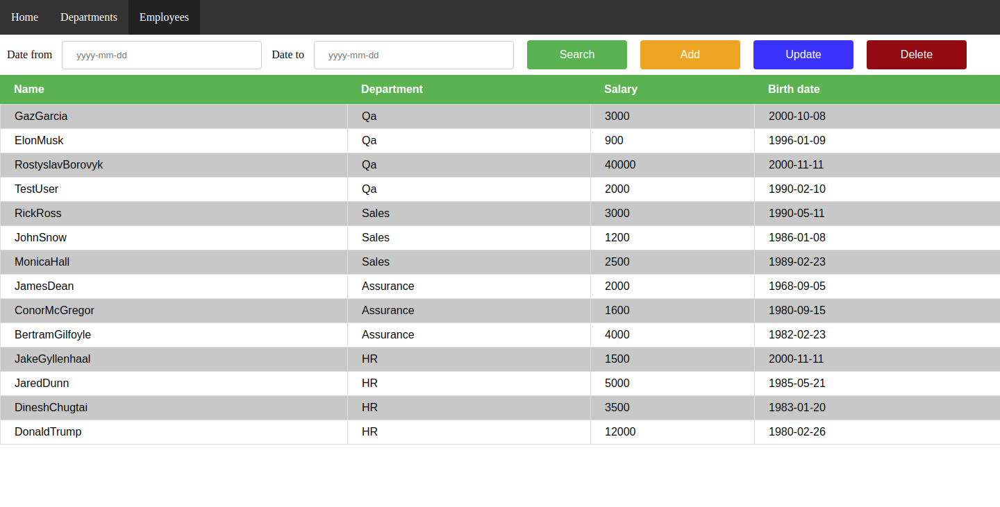

# Graduation work for EPAM python

## Project structure

### Departments page

>Departments page contains list department's name, number of employees
and average salary.

### Employees page

>Employees page contains list employees's name, employees's department,
salary and birth date. You can filter employees by specifying from what
birth date to what you want employees to be displayed and clicking button search.
 
Also tou can add, update, and delete particular employees by clicking corresponding
buttons.

